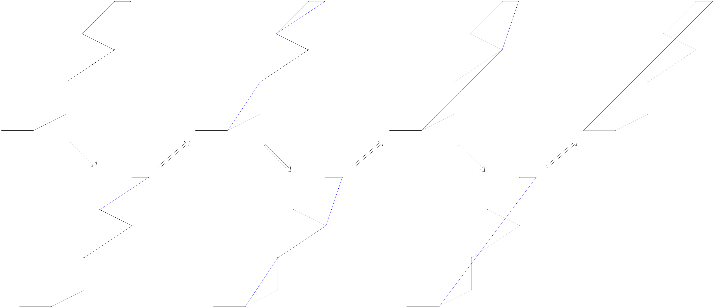

## Disclaimer

This is my bachelor thesis, commited at the University of Konstanz.
See [Bachelor_Thesis.pdf](Bachelor_Thesis.pdf) for full thesis.

---

# Gradual Line Simplification

Simplifying polygonal lines is an important task faced
in many different applications.
There exist many progressive line simplification algorithms that simplify a polygonal line into different level of details.

Here, we deal with another approach of simplifying, so called gradual line simplification (GLS).
It involves the reapeated removal of a single point until we the first and last point are the only ones left.
Meanwhile, each removal forms a new simplification.
There exist different objective functions that can be considered in GLS (see page 23, Example 5.5 in [Bachelor_Thesis.pdf](Bachelor_Thesis.pdf)).
This work mainly consists of exploring these objective functions, defining them formally, discovering algorithms designated to minimize the objective value, as well as an experimental comparison of the algorithms.

---

# Tests

### Simplifier

The [simplifier.jar](simplifier.jar) file is able to simplify a line (.sgpx format - see [util](/util) for more info) using a simplification algorithm under a specific geometric distance metric.

Usage:

    java -jar .\simplifier.jar <pathToLine> <simplifier> <distanceMetric> <optional:removal>

where `pathToLine` is the path to a .sgpx file (e.g. [data](/data)), `simplifier` is the simplification algorithm (see below), `distanceMetric` is a geometric distance metric (see below) and `removal` is an optimal argument that prints the removal sequence if given.

E.g.

    java -jar .\simplifier.jar .\data\l1.sgpx minsum hausdorff
or

    java -jar .\simplifier.jar .\data\l1.sgpx minsum hausdorff removal
to print the removal sequence.

### Visualizer

The [visualizer.jar](visualizer.jar) file has the same functionality as the [simplifier](simplifier.jar), except that the visualizer runs an interface that displays the line, as well as its simplifications.

Usage:

    java -jar .\visualizer.jar <pathToLine> <simplifier> <distanceMetric>

E.g.

    java -jar .\visualizer.jar .\data\l1.sgpx minsum hausdorff

---

## Simplifiers 

There exist many simplifiers, most of them being variations from another.
See section [7.1 Algorithm Overview](Bachelor_Thesis.pdf) in [Bachelor_Thesis.pdf](Bachelor_Thesis.pdf) for more details of every algorithm.

Due to a different implementation, simplifier names in the algorithm implementation mostly differ from their formal expression.
The `<simplifier>` argument for the [simplifier](simplifier.jar) and the [visualizer](visualizer.jar) has to be given by its implementational name.

| Implementational Name        | Formal Name   |
|------------------------------|---------------|
| MinMax                       | MinMax        |
| MinSum                       | MinSum        |
| Greedy                       | Greedy        |
| GreedyPract                  | PGreedy       |
| InOrder                      | IOH           |
| RandomOrder                  | ROH           |
| Equal                        | TOH           |
| MinSMA                       | MinSMA        |
| SumMaxTotalDP                | SMT-DNC       |
| SumSumActiveDP-Exact         | SSA-DNC       |
| SumSumTotalDP-Exact          | SST-DNC       |
| SumSumActiveDP-GTD           | SSA-GTD       |
| SumSumTotalDP-GTD            | SST-GTD       |
| SumSumActiveDP-GBU           | SSA-GBU       |
| SumSumTotalDP-GBU            | SST-GBU       |
| SumSumActiveDP-GCE_GTD_EXACT | SSA-GTD-Exact |
| SumSumTotalDP-GCE_GTD_EXACT  | SST-GTD-Exact |
| SumSumActiveDP-GCE_GBU_EXACT | SSA-GBU-Exact |
| SumSumTotalDP-GCE_GBU_EXACT  | SST-GBU-Exact |
| SumSumActiveDP-GCE_EST_GTD   | SSA-MEST-GTD  |
| SumSumTotalDP-GCE_EST_GTD    | SST-MEST-GTD  |
| SumSumActiveDP-GCE_EST_GBU   | SSA-MEST-GBU  |
| SumSumTotalDP-GCE_EST_GBU    | SST-MEST-GBU  |
| GreedyDiff                   | GD            |

## Geometric Distance Metrics

| Distance Metric Expression | Description                                    |
|-----------------           |------------------------------------------------|
| Hausdorff                  | Hausdorff distance named after Felix Hausdorff |
| Frechet                    | Frechet distance named after Maurice Frechet   |
| DiscreteFrechet            | Discrete adaptation of the Frechet distance    |
| FrechetApprox              | Approximation of the Frechet distance          |
